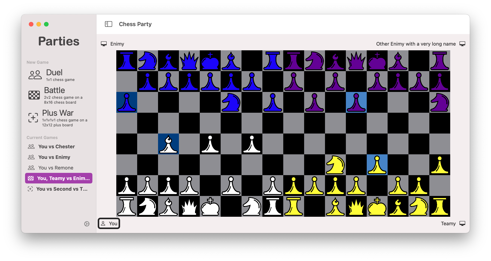

# Chess Party

*Developed by team Vermillingua: Daniël du Preez, and Robert Swanson*

Chess Party is an SwiftUI app that provides elegant chess experience that facilitates traditional games as well as expanded multiplayer. It is a work in progress aiming towards the following features:

- [x] Compatible with iOS, iPadOS, & MacOS
- [x] Adaptive UI with multiple available themes
- [x] Ability to play multiple independent games
- [x] Basic PvP chess functionality (missing promotions, castling and en passant)
- [ ] A selection of chess engines
  - [ ] Minimax implementations with differing “personalities”
  - [ ] Machine learning implementation
- [ ] Game Center multiplayer games
- [x] Flexible implementation that allows for easy implementation of variations of game play ([wikipedia chess variants](https://en.wikipedia.org/wiki/List_of_chess_variants))
  - [x] Duel: Standard 1v1 chess game
  - [ ] Battle: 2v2 play on a 8x16 board team sequence ABAB
  - [ ] [Bughouse Chess](https://en.wikipedia.org/wiki/Bughouse_chess): two standard chess games, except when you capture a piece, your teammate can choose to use a turn to place it on their board
  - [ ] [Four-player chess](https://en.wikipedia.org/wiki/Four-player_chess): 1v1v1v1 on a plus shaped board

